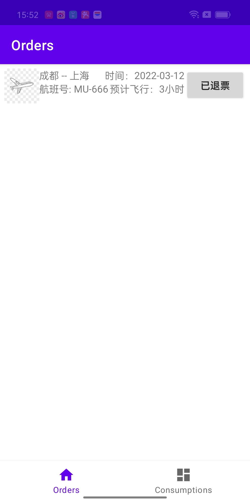
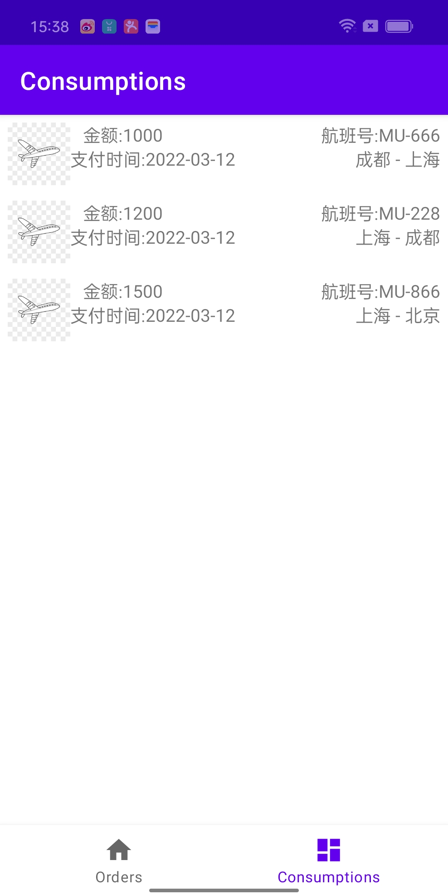

# FlightBooking
黑马考核作业
### MockServer
使用NPM搭建MockServer:
* 具体的操作步骤[https://www.npmjs.com/package/mockserver-node](https://www.npmjs.com/package/mockserver-node)

* 运行文件: node mock_server.js [https://www.npmjs.com/package/mockserver-client](https://www.npmjs.com/package/mockserver-client)

* ./gradlew installDebug

* App运行：./gradlew installDebug

* 运行截图：

* 

  
